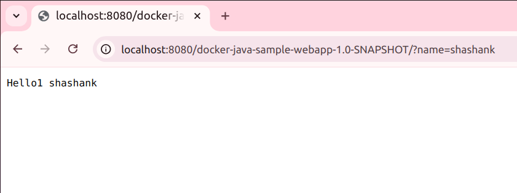
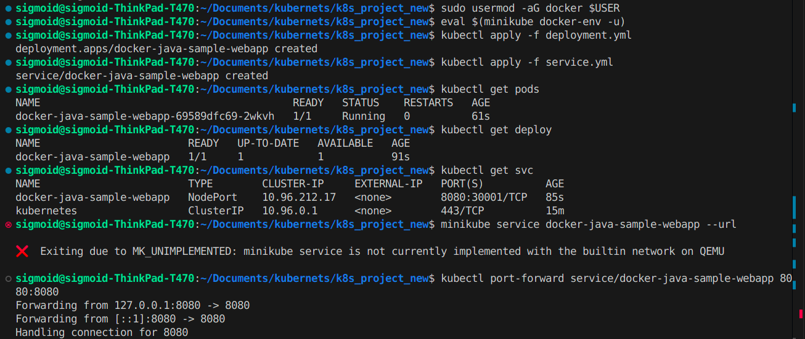

# Docker Java Sample Webapp Deployment on Minikube

1). You need to write required yaml files for this service.

2). You need to create jar for this service first and then create dockerfile for it.

3). After that to deploy this service in kubernetes you need to install minikube in your local or if you have any cloud platform account then it is also fine.

4). You can access this application on any port you want to (it's your choice).

5). This application is deploying tomcat server in kubernetes.

This guide walks you through the steps to build, deploy, and access a simple Java web application packaged as a WAR file in Minikube with Kubernetes.

## Prerequisites

Ensure you have the following installed on your local machine:

- [Minikube](https://minikube.sigs.k8s.io/docs/)
- [Docker](https://www.docker.com/)
- [Kubernetes CLI (kubectl)](https://kubernetes.io/docs/tasks/tools/install-kubectl/)
- [Maven](https://maven.apache.org/)

## Step 1: Build the WAR File

This application is packaged as a WAR file, and Maven will be used to build it.

1. Navigate to the project directory where the `pom.xml` file is located.
2. Run the following Maven command to clean and package your project:

   ```bash
   mvn clean package
   ```

After the build completes, the WAR file (docker-java-sample-webapp-1.0-SNAPSHOT.war) will be generated in the target/ directory.

## Step 2: Install Minikube and Deploy the Application

1. Start Minikube

First, ensure Minikube is running on your local machine:

```bash
minikube start
```

2. Set up Docker to use Minikube's Docker Daemon
   Minikube runs its own Docker daemon, so we need to configure Docker to use it:

```bash
eval $(minikube docker-env)
```

3. Build the Docker Image
   Build the Docker image for the application using the Dockerfile:

```bash
docker build -t docker-java-sample-webapp .
```

4. Push the Image to Docker Hub
   Optionally, push the image to Docker Hub so it can be accessed in Kubernetes:

```bash
docker push docker-java-sample-webapp
```

Replace docker-java-sample-webapp with your Docker Hub username/repository name if needed.

5. Apply Kubernetes Configurations
   Now that the image is built and available, deploy the application to Kubernetes using the following commands:

```bash
kubectl apply -f deployment.yml
kubectl apply -f service.yml
```

Here, deployment.yml defines the deployment configuration, and service.yml defines the service that exposes the application.

6. Verify the Deployment
   Check the status of the pods and services to make sure everything is running properly:

```bash
kubectl get all
```

7. Access the Application
   To access the web application, run the following command:

```bash
minikube service docker-java-sample-webapp --url
```

This will provide you with a URL that you can open in your browser to access the application running inside Minikube.




